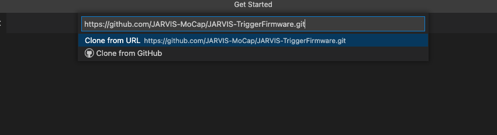
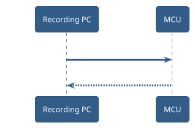
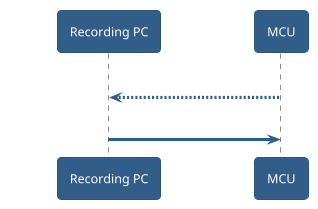
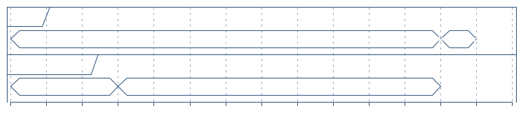
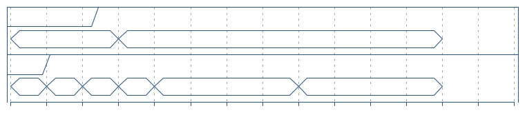
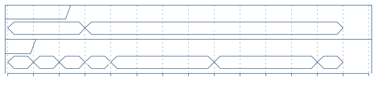
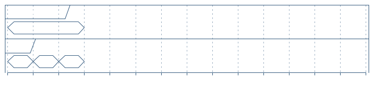
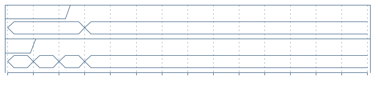

# TriggerFirmware

## Development using PlatformIO

### PlatformIO

PlatformIO is an software ecosystem that greatly simplifies the programming of microcontrollers. It is available as a plugin for many programming environments and can also be run directly from the command line.

#### Installing PlatformIO

We recommend using one of the options below to flash your microcontroller:

##### Visual Studio Code (VSCode)

Installation Guide:
See: https://platformio.org/platformio-ide

After PlatformIO is successfully installed, clone the trigger firmware from Github using git:

Use "Clone Git Repository" in VS Code and type:
`https://github.com/JARVIS-MoCap/JARVIS-TriggerFirmware.git`
in the window that opens.




After that, open the folder manually or press open folder when VS Code asks you for the Git repository you just cloned:

.

If PlatformIO is installed correctly, all the required dependencies should be installed automatically.

After the project is set up correctly, open the PlatformIO tab on the left side of the page


If your microcontroller is officially supported, connect your microcontroller to your machine, open the context menu of the microcontroller you want to flash and press "Upload".

##### CLI

Installation Guide:
See: https://platformio.org/install/cli

Make sure you can run the commands in your terminal:

```bash
platformio run --help
```

#### Flashing a microcontroller

If your microcontroller is supported, you can find a corresponding environment in `JARVIS-TriggerFirmware/platformio.ini`.

To flash your microcontroller, execute:

```bash
platformio run -t upload -e <YOUR_MCU_ENVIRONMENT>
```


## Wireing Guide
The default behavior for all microcontrollers with enough pins is that pins 0-15 are available as trigger outputs for your cameras and pins 16-23 are pullup enabled input pins for the timed logging feature of the Acquisition software. If your microcontroller does not have the required number of pins, or does not have support for functionality such as digital interrupt on all input pins, you should look at the respective header files in the ```boards/``` folder.
## Trigger protocol

The protocol is build for two use cases in mind. The first one is to to give the microcontroller commands, mainly the command to start and stop the triggers that we use for Acquisition. Like shown below:



The ability of the microcontroller to also read inputs and notify the acquisition software is the second use case. For this purpose, the microcontroller sends a message at every COM-loop, if a change has occurred.



!!! warning

    ACKs are not yet handled by the MCU.
    
    Retransmissions are still being investigated.

### Message encoding



### Input Message

+ TYPE_INPUTS



### Setup Message

+ TYPE_SETUP



 | Bit | Flag          | Description                                                                   |
 | --- | ------------- | ----------------------------------------------------------------------------- |
 | 0   | RESET_COUNTER | If set to true (1) the setup command will reset the current Framecounter to 0 |
 | 1-7 | RESERVED      | Reserved flag for later functionality                                         |

### Type-Only Messages

+ TYPE_ACK



### Char Messages

+ TYPE_ECHO
+ TYPE_TXT
+ TYPE_ERROR


