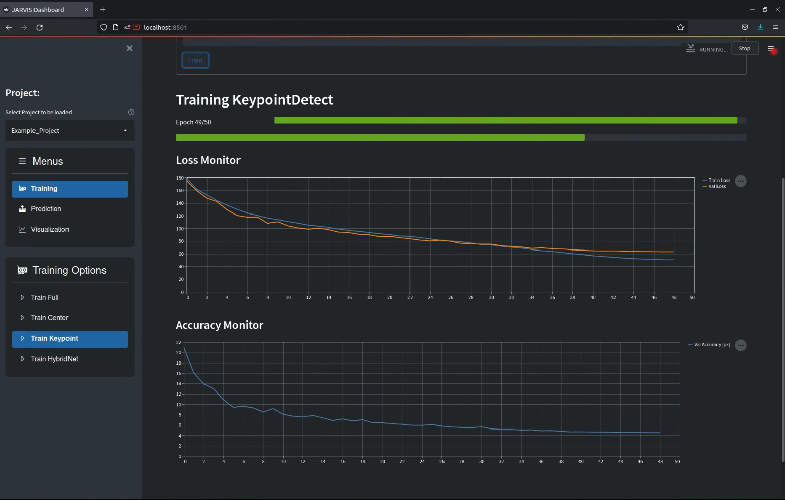

# Exploring the Provided Example Trainingset
Let's start by playing around with our provided example so you can familiarize with our software and get a better feel for the task and the workflow.<br>
The example data we're working with in this tutorial are recordings of one of our monkeys - his name is Ralph - performing a simple grasping task in our 12 camera setup. Your task is to track his hand while he is enjoying a variety of fruits we hand him.
We will split the task into four steps:

1. <span style="color:#63a31f"><b>Installing</b></span> our **Pytorch Toolbox** and downloading the example recordings.
2. <span style="color:#63a31f"><b>Visualizing</b></span> the provided annotations, both in 2D and 3D.
3. <span style="color:#63a31f"><b>Training</b></span> the entire network stack.
4. Usig your freshly trained network to <span style="color:#63a31f"><b>track</b></span> Ralph's hand in the example recording.
<br>


## 1. Installing the Toolbox and Downloading the Data
First let's take care of setting up the software. Make sure you have a version of [Anaconda](https://www.anaconda.com/) installed. If you want to train networks also make sure that your PC has a Nvidia GPU with working CUDA drivers installed.<br>
There are only a few simple steps you need to take to install the toolbox:
- Download the python package. To do this open up a terminal and run:
```
git clone https://github.com/JARVIS-MoCap/JARVIS-HybridNet.git && cd JARVIS-HybridNet
```
Alternatively you download it directly by clicking [here](https://github.com/JARVIS-MoCap/JARVIS-HybridNet/archive/refs/heads/master.zip).

- Create the `jarvis` Anaconda environment by running:
```
conda create -n jarvis python=3.9  pytorch=1.10.1 torchvision cudatoolkit=11.3 notebook  -c pytorch
```

- Activate the environment (you will need to do this every time you open a terminal to use JARVIS):
```
conda activate jarvis
```

- Install the required version of the setuptools package:
```
pip install -U setuptools==59.5.0
```

- Install JARVIS:
```
pip install -e .
```

With that out of the way the only thing left to do is downloading the example recordings by clicking [here](https://zenodo.org/record/6515085/files/Example_Recording.zip?download=1).<br>
<br>
:tada: Congratulations, you are all set up now! To launch our handy streamlit GUI interface just open a terminal, activate the conda environment by running `conda activate jarvis` and type `jarvis launch`.<br> 
Alternatively you can also interact with jarvis through the command line. To do this activate the conda environment and then run `jarvis launch-cli`. The following sections give you the option to switch between instructions for both methods by selecting the respective tabs.
<br>


## 2. Visualizing the Example Trainingset
Before we dive into training JARVIS to track anything it is always a good idea to have a look at the trainingset your are using, both in 2D and in 3D.<br>

=== "GUI"

    To do this using the streamlit dashboard first launch the JARVIS streamlit dashboard as described above by running `jarvis launch`. Once the GUI pops up in your browser you can select the Example_Project from the drop-down menu and then navigate to the visualization menu.<br>

    

    As you can see there are a bunch of option for visualizing both your predictions and your trainingset. You can see how that looks like above, but feel free to play around with it a bit to familiarize yourself with the data you are working with.

=== "CLI"

    To do this using the command line interface first launch it by running <span style="color:#63a31f">'jarvis launch-cli'</span>. You will see a menu appear in your terminal that you can navigate using your arrow keys. To visualize your dataset select the <span style="color:#63a31f">Visualize</span> menu and then pick either the <span style="color:#63a31f">Dataset2D</span> or the <span style="color:#63a31f">Dataset2D</span> option.<br>

    

    To visualize the example trainingset select the 'Example_Project' and the 'Hand' skeleton preset. Other than that feel free to play around with the different options.You can cycle through all the available frames by pressing any key. Pressing 'q' or 'esc' will take you back to the Visualize menu.

Once you start working with your own data, checking your trainingset before training is really important to ensure there was no problem when creating it and your network will get the input you expect it to get.


## 3. Training the Entire Network
Now that you know what our data looks like it is time to train the network stack.

=== "GUI"

    Using our GUI this is really easy, all you need to do is to navigate to the <span style="color:#63a31f">Train Full</span> menu and press train as shown below. If everything works correctly you should see two progress bars as well as a plot showing the training progress appear. Depending on your GPU training might take up to a few hours, so a bit of patience is required at this point. If you don't want to wait you can also continue with our pretrained weights of course.

    

=== "CLI"

    The CLI makes this very easy. All you need to do is launch the interface by running `jarvis launch-cli`, select the <span style="color:#63a31f">Train</span> menu and then run <span style="color:#63a31f">Train all</span> as shown below. If everything works correctly you should see a progress bar appearing. Depending on your GPU training might take up to a few hours, so a bit of patience is required at this point. If you don't want to wait you can also continue with our pretrained weights of course.
    
    


??? info "More Info on Network Training"
    Our network stack is trained in four steps:

    1. **Training CenterDetect:** In this step a 2D-CNN is trained to detect the center of the entity you are tracking. This will be used to estimate the location of the entity in 3D, essentially telling the 3D-CNN where to look.
    2. **Training KeypointDetect:** In this step another 2D-CNN is trained to detect all your annotated keypoints in a single image. The output of this network will subsequently be used to construct the 3D feature volume that is the input of our 3D-CNN. 
    3. **Training HybridNet:** In this step the 3D part of our full HybridNet architecture is trained. It's job is to use the 3D feature volumes created by the KeypointDetect stage to create the final 3D pose predictions.


## 4. Predicting Poses for the Example Recording
If you haven't already you should now download our **[example recording](https://zenodo.org/record/6515085/files/Example_Recording.zip?download=1)**.

=== "GUI"

    Once you have the example recording saved on your computer all you need to do is launch the JARVIS GUI and navigate to the <span style="color:#63a31f">Predict3D</span> menu as shown below. Here you will have to specify a couple of things:

    - **Path of recording directory** is the path of the example recording you just downloaded, it should include the 'Example_Recording' directory.
    - **Weights for CenterDetect / HybridNet** lets you specify which weights you want to use. If you have trained models yourself you can leave them at 'latest'. If you didn't train the network yourself you will have to put the path of the pretrained weights here. They can be found in the 'pretrained' directory inside your 'JARVIS-Hybridnet' folder.
    - **Start Frame & Number Frames** let you select on which part of the recording you want to run the prediction. For quick results set 'Number of Frames' to 1000. To predict until the end of the recording set it to -1.

    Once all those settings are correct, press the  <span style="color:#63a31f">Predict</span> button and wait for the progress bar to fill up as shown below.

    

=== "CLI"

    Once you have the example recording saved on your computer all you need to do is launch the JARVIS CLI and select <span style="color:#63a31f">Predict3D</span> in the <span style="color:#63a31f">Predict</span> menu as shown below. Here you will have to specify a couple of things:

    - The **Recordings Path** is the path of the example recording you just downloaded, it should include the 'Example_Recording' directory.
    - Select <span style="color:#63a31f">No</span> for using <b>TensorRT acceleration</b> for now. If you installed the optional TensorRT packages this lets speed up predictions using NVIDIAs <a href="https://developer.nvidia.com/tensorrt">TensorRT</a> library. Compiling the TRT models takes quite some time though.
    - If you have trained models yourself you can use the most recently saved weights. Otherwise you will have to specify the path of the pretrained weights for the CenterDetect and the HybridNet networks here. They can be found in the 'pretrained' directory inside your 'JARVIS-Hybridnet' folder.
    -  Select <span style="color:#63a31f">No</span> when asked if you want to use a **calibration that is not in the trainingset**.
    -  To quickly get some results also select <span style="color:#63a31f">No</span> when asked wether you want to **predict for the whole video**
    - **Start Frame & Number of Frames** let you select on which part of the recording you want to run the prediction. For quick results set 'Number of Frames' to 1000, to predict until the end of the recording set it to -1.

    After answering all the prompts you should see a progress bar filling up as shown below.

    


Once the process is finished you will find a directory with a current timestamp in the projects folder under <span style="color:#63a31f">predictions</span>. That folder contains a 'data3D.csv' file that contains the 3D coordinates and their corresponding confidences for every point in time. The directory also contains a '.yaml' file that holds some information necessary for creating videos from your predictions.