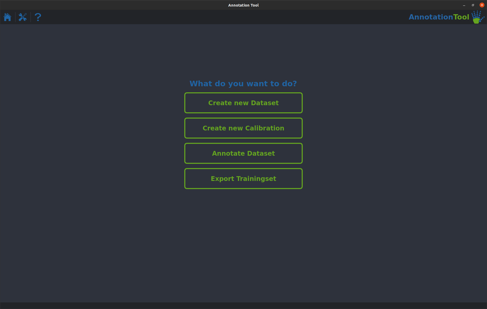

# Creating a New Trainingset from our Example Recordings

Now that you know what a trainingset looks like and how you can use it to train the network we will take a step back and cover the process of creating this trainingset from a multi-camera recording. Like before we will split this task into smaller steps:

1. <b>Installing</b> the AnnotationTool.
2. <b>Extracting</b> a dataset from the Example Recording.
3. <b>Calibrating</b> the Cameras.
4. <b>Annotating</b> a Frameset.
5. <b>Exporting</b> the dataset as a trainingset.

If everything goes according to plan you will end up with a trainingset very similar to the one you used in the previous part of the tutorial.

## 1. Installing the AnnotationTool
If you are using Windows, MacOS or Ubuntu all you have to do is got to our [downloads page]() and grab the installer for your OS. If you are running a different Linux distribution you will have to build the AnnotationTool yourself. There is a guide on how to do that on its [GitHub page](https://github.com/JARVIS-MoCap/JARVIS-AnnotationTool).
Once you install and launch the tool you will be greeted with a home screen that looks like this:

{: .center .rounded width="90%"}

## 2. Extracting a Dataset from the Example Recording
Clicking on the first item in the list on the homescreen will open up the dataset extraction menu. This will allow you to extract framesets from your recordings that you will subsequently annotate. For this tutorial we will stick to the basics and use the fastest and quickest way of extracting a handful of framesets. Definitely check out the relevant [section]() in our Manual to learn all the details about how to create a dataset that is as representative of your entire recording as possible.
First let's go through the options in the Configuration section.
- **New Dataset Name** is the name of the dataset you're going to create.
- **New Dataset Path** is the directory in which your new dataset will be saved.
- **Framesets to extract per Segment** is the number of framesets the tool will create, you can leave it at the default of 10 for this example.
- **Sampling Method** is the method the tool uses to decide which frames in your recording to use. kmeans is the method you should use for your real datasets, but for this tutorial we will use uniform to make the extraction process a bit quicker.

Next up is the Recordings section. Just click Add Recording and navigate to the 'Example_Recording' directory and click Open. 
The last thing left to do is to tell the tool the names of all the Entities and Keypoints you want to annotate. Entities refers to the animal/object you are tracking. (Note: The AnnotationTool supports annotating multiple entities in one dataset, but the rest of our toolbox currently does not). For our example you can load the 'Hand' preset by clicking Load Preset.

{: .center .rounded width="90%"}

If your dataset menu looks like shown above you can click Create to create a new dataset. A progress window should pop up and once it is finished you should find a dataset folder containing a '.yaml' config file as well as a directory containing extracted frames for each camera.

## 3. Creating a Set of Calibration Parameters
One of the most important steps in creating good 3D ground truth annotations is precise camera calibration. As always we have a comprehensive [section]() on how to record calibration recordings in our Manual. For this example we provide a set of example calibration recordings that you can download by clicking **[here](https://zenodo.org/record/6982805/files/Calibration_Example.zip?download=1)**. 
Go back to the homescreen of the AnnotationTool and select the Create new Calibration menu item.
Like before let's first go through the options in the General section.

- **Calibration Set Name** is the name of the set of calibration parameters you're going to create.
- **Calibration Set Savepath** is the directory in which your new calibration parameters will be saved.
- **Separate Recordings for Intrinsics** can be set to no if you want to use your extrinsic recordings for intrinsics calibration. This is not recommended, see the manual for details.
- **Intrinsics Folder Path** is the directory that contains all the recordings for intrinsic calibration (you will find it inside the downloaded 'Calibration_Example' directory).  
- **Extrinsics Folder Path** is the directory that contains all the recordings for extrinsics calibration (you will find it inside the downloaded 'Calibration_Example' directory).

Calibrating on your own data might require you to change some settings in the Calibration Settings and the Checkerboard Layout sections as well. For this example the defaults are already correct though, so you can leave all those settings untouched.

Once you have entered all those settings you can click the Update Cameras button to add all cameras and pairs to the lists. 
After that you're almost ready to calibrate the cameras. The last thing you need to do is to delete the camera pair labeled 'Camera_LC --> Camera_B' and instead add the 3 camera triplet 'Camera_T --> Camera_LC --> Camera_B'. The GIF below shows you how to do that in detail.

{: .center .rounded width="90%"}

You're now ready to click the Calibrate Button. This will take a little bit, but once it is done a info window will pop up showing you the quality of all your calibrations. It should look similar to this:

{: .center .rounded width="90%"}

You will now find a directory containing one '.yaml' calibration file per camera at the path that you specified.

## 4. Annotating a Frameset
Now that you have both a dataset and the calibrations that go along with it you can start annotating your framesets. First navigate back to the homescreen and select the Annotate Dataset item. Navigate to the directory of the dataset you created earlier and select the '.yaml' config file as shown below. You will then get an overview over the different segments of your dataset (in the example case there is only one) and a list of all your cameras. Select the segment you want to annotate and click the Load Dataset button. 

{: .center .rounded width="90%"}

With the dataset loaded succesfully all that's left to do is to add the calibrations you created earlier to the dataset. To do this click on the big blue plus sign on the left side of the screen and select the directory that contains the '.yaml' calibration files. 
After that you can start annotating. The workflow is as following: 
1. <b>Annotate all the frames in one frameset.</b> You can switch between them either by clicking the Next >> and << Previous on the left or by double clicking one of the cameras in the list. As soon as you annotate a keypoint in two or more cameras you will see a error bar appear in the Reprojection Tool. This is an indicator for the consistency of your annotations, the lower the better.
2. <b>Switch to the next frameset once all reprojection error bars are sufficiently low.</b> Once you annotated all joints for one frameset you can switch to the next one using the Next Set >> button. If you have a dataset consisting of more than one segment the dropdown in the top left corner will allow you to switch between segments.

{: .center .rounded width="90%"}

For a real dataset it is important that you annotate all framesets in a dataset before proceeding to the trainingset exporting step. Since this is only a tutorial we suggest you play around with the tool long enough to get familiar with and and get a feeling of how the Reprojection Tool works. Once you feel comfortable you can move on to the next step.

## 5. Exporting a Trainingset
Almost done! As always navigate back to the homescreen and select the last item in the list: Export Trainingset. As before there are a handful of parameters you need to set:

- **Trainingset Name** is the name of the trainingset you will create.
- **Trainingset Savepath** is the directory the trainingset will be saved in.
- **TrainingSet Type** lets you select if you want to create a 2D or a 3D trainingset. 3D trainingsets include the calibration parameters and are what you almost always will be using. Only use the 2D option if you are working with single camera data or you are creating a pretraining trainingset.

The rest of the parameters are related to how the data is split into training and validation data. The defaults should be fine for almost all applications, so just leave them untouched for the example. 
After setting your parameters you can click the blue 'plus' button to add one or more dataset to the trainingset. For the example add only the dataset you did annotate earlier. Selection works just like in the annotation mode by selecting the '.yaml' dataset config file. After adding the dataset the pie chart in the bottom left corner should be show some statistics about your dataset. Since we did not annotate many frames the majority of keypoints will be unnanotated.
If everything looks like shown below you can click the Create Trainingset button.

{: .center .rounded width="90%"}

You should now have a trainingset that has the same structure as the one you used to train your first network.

:tada: That's it! Now it's time to get started with training a model on your own data. If you want to learn more about our toolbox we strongly suggest you have a look at our [Manual](manual/1_manual). There you will find detailed instructions on every step of building a 3D motion capture setup with JARVIS.