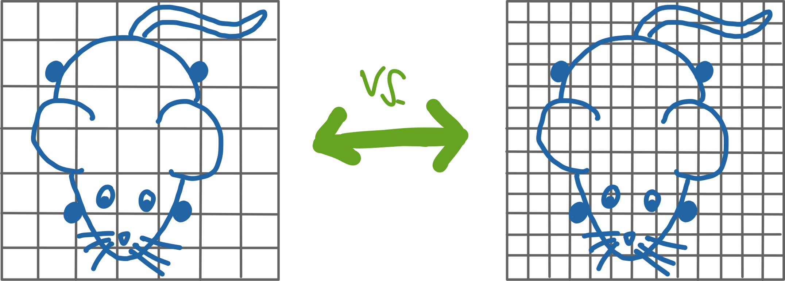
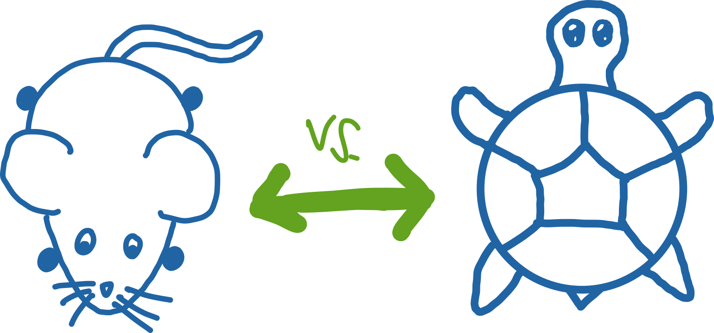
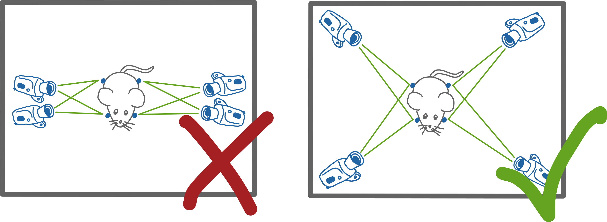
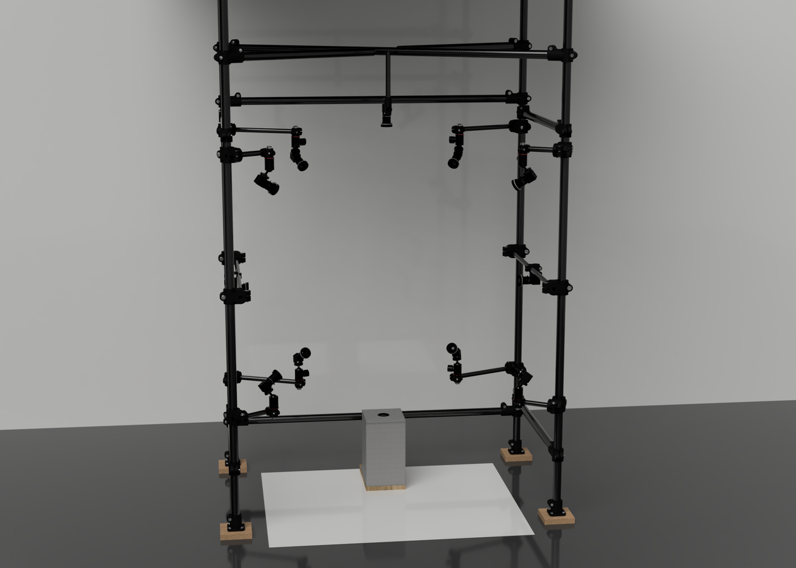

# Designing a 3D Motion Capture Setup

Designing a good Camera Setup for Motion Capture is probably the most critical step to achieve reliable tracking and will safe you a lot of frustration while annotating, training your network and analyzing your data.\
That being said, without a proper starting point the vast number of available cameras, lenses, lighting options and possible setup configurations can be quite overwhelming.
That's why your first step should be to answer the following questions for your planned setup.  
The first set of questions will cover all the camera and lens specific decisions you'll have to make. Keep in mind that if you want to use our Acquisition Tool without any modifications you should use a camera model from our [list of supported cameras](/index.html#supported-cameras).  

- **What is the size of the area my subject will move in and at what distance do I want to mount my cameras?** 
 This will determine the field of view and with that the **focal length** of your lenses. You can use this handy [Calculator](https://www.lensation.de/calculator.html) to help you pick the correct values. If your setup requires lenses with a very short focal length, make sure to get lenses with as little distortion as possible.

    {: .center width="30%" }

- **What is the size of the smallest features you want to resolve?** 
  This will determine the resolution of your camera sensor. Make sure you are able to annotate all the keypoints you want without to much difficulty at the resolution you choose.

    {: .center width="40%" }

- **What is the fastest speed my subject will move at?** 
  This will determine both the minimum frame rate you need to record at and the maximum exposure time you can use. As a rough rule of thumb a framerate of 50 Hz works well for everyting that moves at human speed or lower, for fast moving subjects like monkeys or mice you'll want to go up to at least 100 Hz. If you want a more rigorous rule the [Nyquist Theorem](https://en.wikipedia.org/wiki/Nyquist_frequency) is your friend.

    {: .center width="40%" }

- **How long will the cables going from my cameras to the recording computer be?** 
  This will determine whether GigE or USB3.0 cameras are the better choice for you. We generally recommend using USB cameras, but for distances longer than a couple of meters the ethernet based GigE cameras are the better choice.

  {: .center width="40%" }

Now that the configuration of the individual cameras is out of the way, we can move on to the most important question regarding the whole setup.  

**How precise does the tracking need to be for my application and how much occlusion (both by other objects in the setup and by the subject     itself) do I expect?**

This is the most important question as it determines the number of cameras you will need to use. First of all think about how many cameras fit into your budget keeping in mind that more cameras also require a more powerful recording computer. You can then determine the absolute minimum number of cameras that you need by making sure that every keypoint you want to track is visible in at least two cameras at all times, as illustrated in the sketch below. Note that this is the absolute minimum and depending on the precision you require we recommend to have every keypoint visible in at least three or four cameras at all times.

{: .center width="30%" }

While thinking about your camera configuration try to make the angles between the cameras as wide as possible. Ideally you want to distribute your cameras as evenly as possible on a sphere around your tracking volume. The sketch below again tries to illustrate that principle.

{: .center width="70%" }

With that all of the basic design decisions should be covered and the only thing left is a list of some of the easily overlooked but still very important things to consider:

- There are two ways to go about mounting your cameras. You can either build a very rigid and permanent mounting system, or one that is flexible and easily repositioned. Both have their obvious advantages and disadvantages and you need to decide what fits your setup structure best. But keep in mind that by going for a flexible system you will have to recalibrate your setup **EVERY** time you use it. Accurate calibrations are **the** foundation of precise 3D tracking and its hard to stress its importance enough.
- Make sure you design your setup in a way that allows you to record good calibration videos. You can check out our [example calibration recording](https://zenodo.org/record/6982805/files/Calibration_Example.zip?download=1) to get an idea of how that looks like.  

To close of this section, here is a render of the basic structure of our 12 camera hand-tracking setup, incase you need some inspiration:

{: .center .rounded width="60%" }
