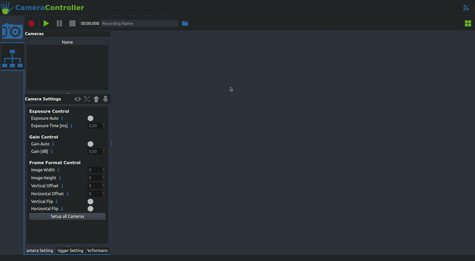

# Setting up the AcquisitionTool

{: .center .rounded width="80%" }


With the basic setup design out of the way, the next challenge to tackle is getting all your cameras to record synchronized videos for you. Our AcquisitionTool makes this process very easy for all [FLIR machine vision cameras](https://www.flir.eu/browse/industrial/machine-vision-cameras/modelselector/).

## 1. Hardware Requirements

- <span style="color:#63a31f">**A set of FLIR cameras:**</span> We recommend the BlackFly S model, but choose whatever fits your application best.
- <span style="color:#63a31f">**Matching GPIO cables:**</span> Those are required to hook up the external trigger, you can order them with your cameras on the FLIR website.
- <span style="color:#63a31f">**An Arduino Uno (or similar):**</span> This will be used as the source of the external trigger (And as a way to control and monitor your setup in future releases).
- <span style="color:#63a31f">**A recording computer**</span> with the following specs:
- <span style="color:#63a31f">**A proper lighting solution:**</span> This one really depends on your setup, so we can't give any exact recommendations. But make sure you don't forget to take proper lighting into account when designing your setup. The most important factors here are even illumination from all sides and overall brightness.

    * **A recent Nvidia GPU:** 10xx, 20xx and 30xx series cards will work. If you are using more eight cameras or more we recommend at least a 2080 or preferably a 30-series card.
    * **A decent CPU** Our tool offloads most of the work to the GPU, a modern Intel i7 or equivalent is strongly recommended.
    * **A fast SSD** Even with compression you are still writing a lot of data. We recommend SSDs with a write speed of at least 3000 MB/s.
    * **Enough USB Ports:** Make sure you have enough available USB3 ports if you are using USB cameras. FLIR sells some suitable [USB Host Controller Cards](https://www.flir.eu/products/usb-3.1-host-controller-card/). 
    !!! warning "Be aware of USB bandwidth sharing when using motherboard usb ports"
        <span style="color:#bb6d24">**Caution:**</span> Some USB ports on your computer can share their bandwidth, which will cause issues if you are recording at high resolutions. You can check that in the spec sheet of your motherboard or the **Hardware check** tab in the **AcquisitionTool Settings**.


## 2. Software Installation

The first thing you will have to do is install the **FLIR Spinnaker SDK**. You can download it [here](https://www.flir.eu/products/spinnaker-sdk/). If you are running Windows make sure to download the '\*_x64.exe' found in the 'Latest Spinnaker Full SDK' directory. For Linux the '\*amd64-pkg.tar.gz' is the package you want.\
Once that is installed you can grab the [AcquisitionTool Installer](https://jarvis-mocap.github.io/jarvis-docs//2021-10-29-downloads.html) from the Downloads section. Under Windows just run the installer and follow the instructions. Under Linux you can install the AcquisitionTool by running `sudo apt install ./JARVIS-AcquisitionTool_1.0-1_amd64_2004.deb` (Make sure to replace the version numbers with the version you downloaded).
If the installation completed successfully the AcquisitionTool should now be available in your Start menu under Windows. If you are running Linux you can open it by typing `AcquisitionTool` into a terminal and pressing enter.

This is a good time to test out if everything is working as intended, before we move on to setting up synchronization with the external trigger.\
For a quick test connect at least one or two cameras to your computer, launch the AcquisitionTool and navigate to the Connection mode as shown below. You can now either connect each camera individually by clicking one of the  slots or simply detect all cameras with the <span style="color:#63a31f">**Auto Detect Cameras**</span> button. If that works you can then switch back to the Acquisition Mode. If your cameras are in their default mode you should be able to get them streaming by clicking the   button in the top left corner. If you now see live images of what all your cameras are seeing you are set to move on to the next and final setup step for the AcquisitionTool.

{: .center .rounded width="90%" }

??? info "Troubleshooting and Hints"

    1. **Cameras not connecting:** If your cameras do not show up after clicking the Auto Detect button there's a couple of things you can do:
        
        - Make sure your camera is plugged into a (not shared) USB3 port (Usually the ones with the blue plastic part).
        - Check whether you are able to access them in SpinView. If that also fails try reinstalling the Spinnaker drivers.
        - Linux only: Make sure you did setup the group permissions and the USB buffer size correctly.

    2. **Cameras not streaming:** If any of your cameras are not showing an image after you start streaming this is very likely due to them being set up in a non standard acquisition mode. To make sure they have their default settings loaded you can follow the these steps:

        - Select a camera by double clicking its name in the list in the top left corner
        - Click the   arrow in the top right corner of the 'Camera Settings' Tab. This should open up the presets menu.
        - In the menu select the 'Default' UserSet by clicking on it and press 'Load'.
        - Try streaming again by clicking the green  button, it should now work for the camera you selected.
        - Repeat those steps for all cameras that are not showing an image.

    3. **Building the Tool from source:** If you are planning on using the AcquisitionTool on a different Linux distribution or are interested in modifying the source code check out the **[GitHub Repo](https://github.com/JARVIS-MoCap/JARVIS-AcquisitionTool)**! It has detailed instructions on how to build the tool and its dependencies yourself.


## 3. Setting up the External Trigger

At this point you should have a recording setup that can be controlled using our AcquisitonTool and can stream video from all of your cameras. The last but very important step that is still missing is making sure all cameras record their videos perfectly in sync. To do this we use an external trigger pulse supplied by an [Arduino Uno](https://store.arduino.cc/products/arduino-uno-rev3) (or similar, our PlatformIO project supports many of the commonly used Microcontrollers).

#### Programming the Arduino
Programming the Arduino is really easy thanks to our PlatformIO install scripts for both Linux and Windows. Simply do the following:

=== "Linux"
    - Clone our [TriggerFirmware Repository](https://github.com/JARVIS-MoCap/JARVIS-TriggerFirmware) from GitHub with:
    ```
    git clone --recursive https://github.com/JARVIS-MoCap/JARVIS-TriggerFirmware.git
    ```

    - Change into the TriggerFirmware directory and execute the install script:
    ```
    cd JARVIS-TriggerFirmware && sh install_arduino_uno.sh
    ```

=== "Windows"
    - Clone our [TriggerFirmware Repository](https://github.com/JARVIS-MoCap/JARVIS-TriggerFirmware) from GitHub with:
    ```
    git clone --recursive https://github.com/JARVIS-MoCap/JARVIS-TriggerFirmware.git
    ```
    !!! warning "Do not use the `Download ZIP` option on GitHub"
        GitHub does not include all neccessary submodules in its .zip download. If you don't have git installed on your computer you can click **[here](https://github.com/JARVIS-MoCap/JARVIS-TriggerFirmware/releases/download/v0.1/JARVIS-TriggerFirmware.zip)** to download a .zip folder containing all the necessary data.

    - Change into the TriggerFirmware directory and execute the installer batch file:
    ```
    cd JARVIS-TriggerFirmware && install_arduino_uno.bat
    ```

Now comes the slightly tricky part. wiring up all the trigger cables. The exact connections you have to make depend on your exact camera model, but the general idea is always the same:

- Connect the ground (GND) pins of all cameras to one of the pins on the Arduino labeled GND.  
- Connect the trigger input (check your cameras datasheet) pin of all cameras to pin 6 of your Arduino.

For more details on how to hook up your specific camera [this guide](https://www.flir.eu/support-center/iis/machine-vision/application-note/configuring-synchronized-capture-with-multiple-cameras/) from FLIR might be helpful. Here is a very basic wiring diagram for the FLIR BlackFly S:

{: .center .rounded width="70%" }


Once your Arduino trigger system is all wired up you can go back to the AcquisitionTool and connect the trigger using the  button. To make the cameras use the trigger signal there are a few settings you will have to change on each camera. Again, the exact settings might vary slightly depending on your camera model. This guide shows the settings for the BlackFly S, check FLIRs documentation on your camera model if those settings don't work. Here's the step-by-step guide:

1. Select a camera by double clicking its name in the list in the top left corner
2. Make sure the cameras default settings are loaded:

    - Click the  arrow in the top right corner of the 'Camera Settings' Tab. This should open up the presets menu.
    - In the menu select the 'Default' UserSet by clicking on it and press 'Load'.

3. Click the  button to get access to all settings.
4. Here's all the settings you will have to change:

    - **Trigger Mode:** On
    - **Trigger Source:** Line3
    - **Trigger Overlap:** ReadOut
    - **Pixel Format:** BayerRG8
    - **Exposure Auto:** Off
    - **Exposure Time:** Needs to be shorter than the time between your frames (At 100 FPS the limit is 10 ms). Caution: The value is set in microseconds!

With all those settings adjusted you should now be able to record synchronized videos! To be sure it's best to do a test recording and checking if all videos have exactly the same length.