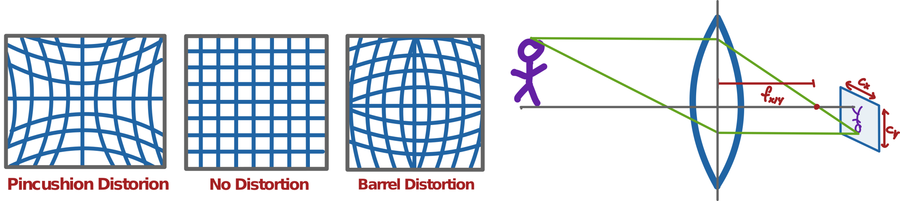

# Recording Good Calibration Videos 
## Intrinsics Calibration

The first step to get your camera calibration files is to record one calibration video for each camera. This video will be used to compute its focal length, principal point offset and distortion
parameters. Or in simpler terms: all the camera specific parameters that we need for 3D reconstruction.

{: .center width="75%"}

There are a few rules you have to follow to get the best intrinsics calibration possible:

- **Move the checkerboard along all axis (especially rotation!)** 
  Make sure you do not only record frames with the checkerboard parallel to the camera (as shown in the picture on the left). Not rotating it enough makes it impossible for the calibration tool
  to estimate the focal length correctly.

{: .center width="50%"}

- **Fill as much of the field of view with the checkerboard as possible** 
  Make sure to be close enough to the camera to take advantage of the full resolution of your camera to cover at least 2/3
  of the cameras field of view. Obvioulsy it's just as important to not get so close the camera looses focus, a bigger checkerboard will help in those cases.

{: .center width="50%"}

## Extrinsics Calibration

The second step is to select a primary camera. This camera defines your reference frame when doing 3D reconstruction. To calibrate the extrinsic parameters you will have to record videos for all possible camera pairs that contain the primary camera. Those videos will be used to calculate the position of all secondary cameras relative to the primary camera.

{: .center width="40%"}

The main thing to watch out for during extrinsics recordings is that both cameras have a good and unoccluded view of the checkerboard. As long as that's the case it is as simple as just waving the board around as much as you can.\
Side note: While it is **strongly** recommended to record seperate videos for intrinsics and extrinsics it is possibly to use your extrinsic recordings for intrinsics calibration.
If you do so make sure to still follow the intrinsic calibration rules during your recordings. jsdkjansdkjnasdkjasndkjasnd askjdnaskdj

<table id="info">
  <tr>
    <td>Annotated Frames</td>
    <td>3000</td>
  </tr>
  <tr>
    <td>Number of subjects</td>
    <td>1</td>
  </tr>
  <tr>
    <td>Dataset Size</td>
    <td>0.7 GB</td>
  </tr>
  <tr>
    <td>Recordings Size</td>
    <td>1.3 GB</td>
    </tr>
</table>

The main thing to watch out for during extrinsics recordings is that both cameras have a good and unoccluded view of the checkerboard. As long as that's the case it is as simple as just waving the
board around as much as you can.\